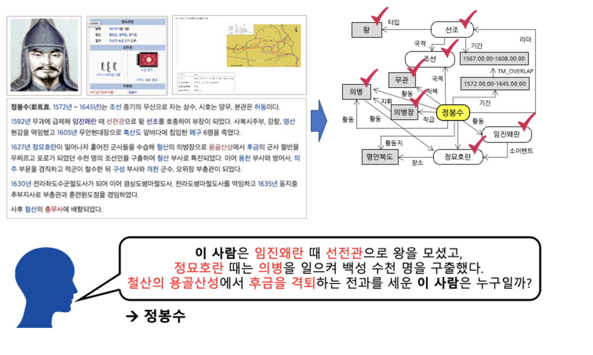

# klue/RE(Relation Extraction)

## [Wrap-up Report](https://harmless-direction-87c.notion.site/Wrap-up-867d98d321074ba8828aabdc9960d4e8)

## 소개

### 문장 속에서 단어간에 관계성을 파악하는 것은 의미나 의도를 해석함에 있어서 많은 도움을 준다.

그림의 예시와 같이 요약된 정보를 사용해 QA 시스템 구축과 활용이 가능하며, 이외에도 요약된 언어 정보를 바탕으로 효율적인 시스템 및 서비스 구성이 가능함.
관계 추출(Relation Extraction)은 문장의 단어(Entity)에 대한 속성과 관계를 예측하는 문제이다. 
- 관계 추출은 지식 그래프 구축을 위한 핵심 구성 요소로, 구조화된 검색, 감정 분석, 질문 답변하기, 요약과 같은 자연어처리 응용 프로그램에서 중요하다.   
- 비구조적인 자연어 문장에서 구조적인 triple을 추출해 정보를 요약하고, 중요한 성분을 핵심적으로 파악할 수 있다.

 

### Data 예시

- train.csv: 총 32470개
- test_data.csv: 총 7765개 (정답 라벨 blind = 100으로 임의 표현)
- 라벨 종류

## 프로젝트 팀 구성 및 역할

> **김현수** : 1. Entity Embedding layer 를 BERT 계열 모델에 추가 및 성능평가, 
            2. BERT 계열 모델에서 나온 Hidden state 에서 CLS 토큰과 Entity 토큰 을 사용하여 분류하는
                 모델 구현 및 성능평가

> **이성구 :** EDA(토큰 길이 확인, 품사별 통계), 앙상블(softvoting, weighted voting), loss 함수 추가실험 (NT-Xent loss), 결과 시각화 툴 제작
> 

> **이현준** : 1. BERT 계열에 CNN layer 를 추가 및 성능평가.
            2. R-BERT 구현, R-BERT 에 CNN layer 추가와 Bi-LSTM layer 추가.
> 

> **조문기** : Data EDA 및 데이터 증강(AEDA, Random delete 등), 데이터 전처리(entity token 등), 모델링(xlm-roberta)
> 

> **조익노** :EDA, 데이터 전처리, 증강(AEDA), 정성 분석, 모델링(RoBERTa-large-typed-marker)
>

## 프로젝트 수행 결과

### 탐색적 분석 및 전처리
- Entity type을 영어 약자에서 한글로 바꿔주는 작업을 시행함.
    - PER: 사람, ORG: 조직, DAT: 날짜, LOC: 장소, POH:단어, NOH: 숫자
    - 영어 약자를 한글로 바꿈으로써 원래 있는 사전에 있는 단어를 활용해 학습을 용이하게 함.
- Subject/Object entity 양 옆에 해당 단어가 entity임을 알려주는 표지 token을 추가함. 더불어, 단어 왼편에 entity type도 표기함.
    - ex) 철수는 대구에 갔다. ⇒ @*사람*철수@는 #^장소^대구#에 갔다.

### 모델 개요

### 개별 모델 평가 결과
|  | LB micro f1 score | LB auprc | eval micro f1 score (MAX) | eval auprc |
| --- | --- | --- | --- | --- |
| BaseLine (BERT) | 65.3435 | 63.2901 | 83.659 | 77.511 |
| BaseLine (BERT) + focal | 66.6257 | 65.9068 | 84.022 | 76.459 |
| BERT+CNN | 67.1433 | 68.1181 | 85.865 | 74.103 |
| R-BERT | 70.8696 | 72.2426 | 86.905 | **79.732** |
| R-BERT + BiLSTM | 70.0498 | 72.3810 | 87.004 | 73.098 |
| R-BERT+CNN | **71.9603** | 75.3618 | **87.185** | 79.396 |
| RoBERTa + BiLSTM | 71.7329 | **75.4457** | 87.036 | 76.849 |
| Entity-embedding | 68.8931 | 73.0077 | 86.535 | 79.430 |
| Xlm-RoBERTa-large | 70.6403 | 73.7103 | 86.105 | 78.767 |
| RoBERTa-large | 70.6168 | 72.6701 | 86.794 | 76.965 |
---

### 앙상블 

- 개별적으로 실험한 모델을 바탕으로 voting 앙상블을 진행함.

선정한 모델들에 대해 voting을 적용함. voting 방법은 3가지임.

- Soft voting : 선정한 모든 모델의 softmax 출력값(probabilities)을 평균내어 결과확인.
- Hard voting : 과반으로 예측한 라벨에 대해서, 가장 높은 probability를 낸 모델의 결과를 샘플마다 사용.
- Weighted voting : 기준라벨 $i$ $(0≤i<30)$에 대해 $j$ 번째 모델이 서로 다른 weight $w_{i,j}$를 가지도록 해 weighted voting을 진행함. 다음 과정을 거침.
    - 최적의 $w_{i,j}$ 구하기 : 모든 evaluation 샘플에 대해 $k\in$ (라벨이  $i$인 샘플 $\cup$ 예측 과반이 $i$ 인 샘플)을 선별한 뒤, micro-F1과 AUPRC의 평균이 제일 높은 $w_i\in\mathbb{R}^{J}$, $J$는 모델 개수)를 grid searching으로 찾음.
    - 모델 j가 샘플 k에 대해 예측한 probabilities, $prob_{k,j}$ $\in \mathbb{R}^{30}$ 라고할 때 voting 결과는 다음과 같음.
        - $prob_{k}$ = $\sum_{j}w_{i,j}* prob_{k,j} (i=soft voting예측 라벨)$

|  | all hard-voting | all soft-voting | all weighted-voting | top3 hard-voting | top3 soft-voting | top3 weighted-voting |
| --- | --- | --- | --- | --- | --- | --- |
| eval micro f1 | 88.053 | 87.912 | **88.637** | 87.647 | 87.820 | 88.366 |
| eval AUPRC | 78.733 | 84.080 | **84.600** | 81,319 | 83.841 | 84.976 |
| eval accuracy | 85.964 | 85.785 | **86.613** | 85.516 | 85.673 | 86.501 |
| LB micro f1 (public) | X | **74.7952** | 74.6847 | X | 73.7781 | 73.7166 |
| LB AUPRC (public) | X | **79.7451** | 79.1676 | X | 79.6115 | 78.9171 |
| LB micro f1 (private) | X | 73.6739 | **74.0193** | X | 72.8960 | 73.2097 |
| LB AUPRC (private) | X | **81.3153** | 80.7537 | X | 79.4710 | 78.7631 |

- 6개의 모델을 voting한 결과가 top-3 모델을 voting한 결과보다 좋았음.
- weighted voting 결과가 soft voting보다, eval set에서는 높지만 test set에서는 낮은 데 evaluation set과 test set의 label 분포가 많이 달라 그런 것으로 추측됨.

## 대회 결과

Public 6등(F1: 74.7952, AUPRC: 79.7451) → Private 7등(F1: 73.6739, AUPRC: 81.3153)
